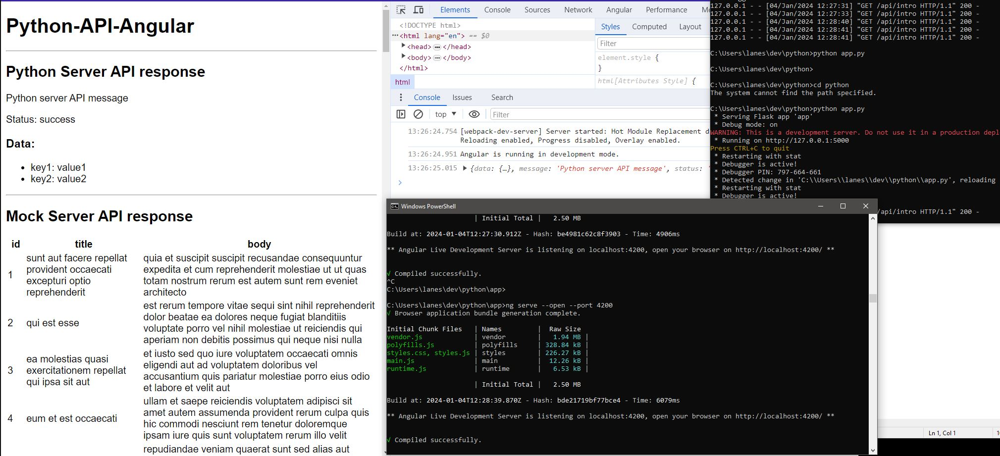

# Python-API-Angular

This project was generated with [Angular CLI](https://github.com/angular/angular-cli) version 16.0.0.

## Development server

Run `ng serve` for a dev server. Navigate to `http://localhost:4200/`. The application will automatically reload if you change any of the source files.

## Code scaffolding

Run `ng generate component component-name` to generate a new component. You can also use `ng generate directive|pipe|service|class|guard|interface|enum|module`.

## Build

Run `ng build` to build the project. The build artifacts will be stored in the `dist/` directory.

## Running unit tests

Run `ng test` to execute the unit tests via [Karma](https://karma-runner.github.io).

## Running end-to-end tests

Run `ng e2e` to execute the end-to-end tests via a platform of your choice. To use this command, you need to first add a package that implements end-to-end testing capabilities.

## Further help

To get more help on the Angular CLI use `ng help` or go check out the [Angular CLI Overview and Command Reference](https://angular.io/cli) page.

---

# Python 

> I will be using `Flask` is a popular Python web frameworks for building robust back-end systems

## API Python

```js
// RUN BACK-END
// New-Item -ItemType File app.py
// app.py
from flask import Flask, jsonify

app = Flask(__name__)

@app.route('/api/hello')
def hello():
    return jsonify(message='Hello, World!')

if __name__ == '__main__':
    app.run(debug=True)
```

```js
python app.py
```

> This simple Flask app creates an API endpoint /api/hello that returns a JSON response with the message from server

```js
// RUN FRONT-END
// use angular 20
npm i -g @angular/cli

ng new --routing=false --style=css --standalone

ng version

cd AppProject/src/app

ng serve --open --port 4200
```

## Demo


